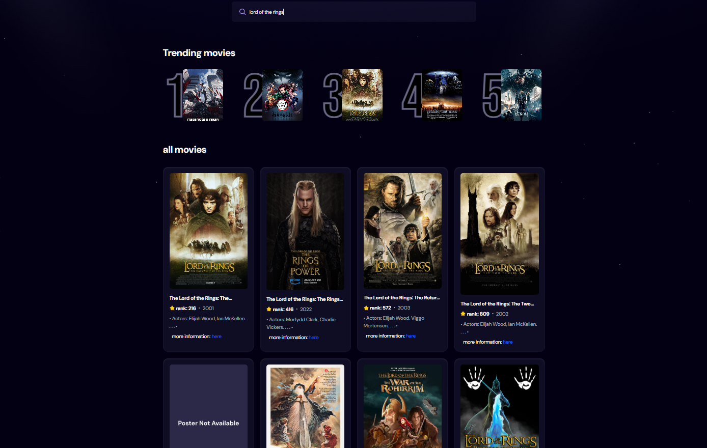

🎬 React Movie Finder App

A fast, modern movie search application built with React + Vite, using the IMDB Search API for movie data and Appwrite Cloud for tracking search metrics.
The application allows users to search movies in real time, view posters and details, and helps track trending searches using Appwrite.

🔗 Live Demo

-> https://react-movie-app-49zr.vercel.app

✨ Features

-> Live movie search with debounced input (efficient API usage)

-> Fast performance using Vite + React hooks

-> Displays movie posters, titles, ranks, and descriptions

-> Dynamic homepage with randomized popular searches

-> Loading spinner + error handling

-> Appwrite-powered analytics

Stores searchTerm, count, movie_id, poster_url

Updates count each time a movie is searched

-> Beautiful, responsive UI

-> Deployed on Vercel

📸 Screenshots

🛠️ Tech Stack
[Frontend]

  React (Vite)

  Tailwind CSS

  react-use (for debounce)

[Backend / Cloud]

  Appwrite Cloud Database (Serverless backend)

  Appwrite Web SDK

[APIs]

  IMDB Search API (iamidiotareyoutoo.com)

[Deployment]

  Vercel

📁 Project Structure
react-movie-app/
├── public/
├── src/
│   ├── components/
│   │   ├── MovieCard.jsx
│   │   ├── Search.jsx
│   ├── appwrite.js
│   ├── App.jsx
│   ├── main.jsx
├── .gitignore
├── package.json
├── vite.config.js
└── README.md

🔧 Environment Variables

Create a .env file in your project root:

VITE_APPWRITE_PROJECT_ID=your_project_id
VITE_APPWRITE_DB_ID=your_database_id

These values are found inside your Appwrite dashboard.

[{ Installation & Setup }]

Follow the steps below to run the project locally:

1. Clone the repository
git clone https://github.com/Nick-hill-727/react-movie-app
cd react-movie-app

2. Install dependencies
npm install

3. Add environment variables

Create .env with the Appwrite credentials.

4. Start Dev Server
npm run dev

The app will open at:
👉 http://localhost:5173

📊 Appwrite Integration (Search Analytics)

Each time a user searches for a movie:

The app checks if the searchTerm already exists in Appwrite.

If it exists → increments the count.

If not → creates a new document with:

searchTerm

count: 1

movie_id (IMDB ID)

poster_url (poster link)

This will be used later to create:

-> A Trending Movies page
-> Search history insights
-> Most searched titles dashboard

🌐 API Reference

The app uses this endpoint:

GET https://imdb.iamidiotareyoutoo.com/search?q=<searchTerm>

The API returns:

Poster URL

Title

Rank

IMDB ID

Year

Description

📝 License

This project is open-source under the MIT License.

👤 Author

Nikhil
GitHub: https://github.com/Nick-hill-727

Vercel deployed project included above.
